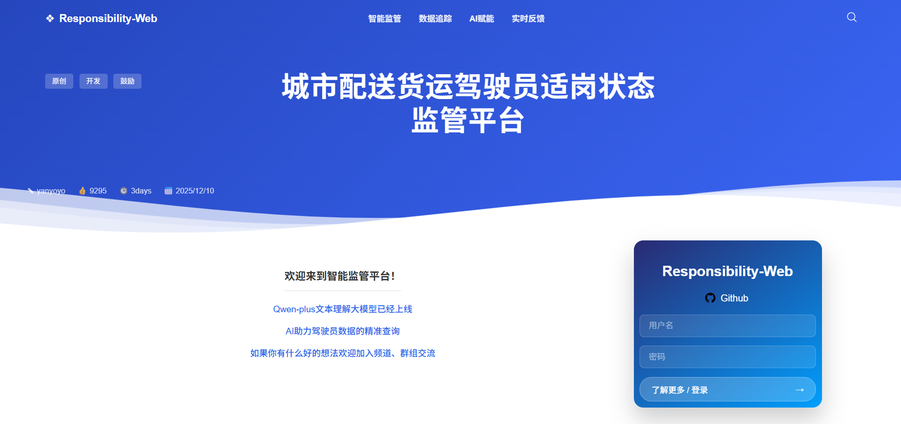

<div align="center">

# Responsibility-WebNEW

A simple Spring Boot + Vue 3 separated frontend/backend project, featuring driver information management, a visualization dashboard, and an AI assistant.



<p>
  <a href="https://openjdk.org/" target="_blank" rel="noopener noreferrer"></a>
  <a href="https://spring.io/projects/spring-boot" target="_blank" rel="noopener noreferrer"></a>
  <a href="https://vuejs.org/" target="_blank" rel="noopener noreferrer"></a>
  <a href="https://vitejs.dev/" target="_blank" rel="noopener noreferrer"></a>
  <a href="https://echarts.apache.org/" target="_blank" rel="noopener noreferrer"></a>
  <a href="https://www.mysql.com/" target="_blank" rel="noopener noreferrer"></a>
  <a href="LICENSE"></a>
</p>

<p>
  <a href="http://localhost:8080" target="_blank" rel="noopener noreferrer"></a>
  <a href="http://localhost:5173" target="_blank" rel="noopener noreferrer"></a>
  <a href="http://localhost:8080/api" target="_blank" rel="noopener noreferrer"></a>
</p>

**English** | [中文](README.md)

</div>

## 🔥 Highlights
- 50 sample drivers + automatic database summary injected into the prompt for more grounded answers
- Dashboard visualization: linked charts, China/Chongqing maps (online GeoJSON), heatmaps/routes
- AI assistant: welcome bubble, typewriter effect, copy/download/reset chat history, one-click suggestions

## 🧩 Tech Stack
- Backend: Spring Boot 4.0.0, Java 21, MySQL 8, JdbcTemplate (Spring JDBC)
- Frontend: Vue 3, Vite, Vue Router, ECharts
- AI: Alibaba Cloud DashScope (OpenAI compatible mode), `qwen-vl-plus`

## ✨ Features
- Driver management: list/search/detail/create/update/delete/batch delete
- Visualization dashboard: linked charts, maps (online GeoJSON), heatmap/routes, etc.
- AI assistant: welcome + typewriter output + chat utilities

## 🚀 Quick Start
### 1) Prerequisites
- JDK 21+
- Node.js 18+ / npm
- MySQL 8+ (create database `driverdata`)
- DashScope API Key (config key `dashscope.api.key`)

### 2) 🗄️ Initialize Database
Import `create_drivers_information.txt` into database `driverdata`:
- Table: `drivers_information`
- Data: 50 sample driver records

### 3) 🧠 Run Backend (Spring Boot)
Config file: `springboot/src/main/resources/application.properties`
- MySQL: `spring.datasource.*`
- DashScope: `dashscope.api.key`

Run:
```powershell
cd springboot
.\mvnw.cmd spring-boot:run
```
Default: `http://localhost:8080`

### 4) 🖥️ Run Frontend (Vue 3 + Vite)
```powershell
cd vue
npm install
npm run dev
```
Open:
- Login: `http://localhost:5173/login`
- Dashboard: `http://localhost:5173/dashboard`

Dev proxy: Vite proxies `/api` → `http://localhost:8080` (see `vue/vite.config.js`).

## 📡 API
### 🤖 AI
- `POST /api/ai/chat`
  - body example:
    ```json
    {
      "message": "What is Zhang Wei's fatigue status?",
      "history": [{"role":"user","content":"..."}]
    }
    ```
  - response: `{ "success": true, "content": "..." }` or `{ "success": false, "error": "..." }`

Note: the backend injects a database summary into the system prompt, then calls DashScope.

### 🧑‍✈️ Driver
Prefix: `/api/driver`
- `GET /list` list all drivers
- `GET /search?name=xxx` fuzzy search by name
- `GET /{id}` get by id
- `POST /add` create (JSON body)
- `PUT /update` update (JSON body, must include `id`)
- `DELETE /{id}` delete
- `DELETE /batch` batch delete (body is an array of ids)

Response shape: `{ code, message, data }`

## 🧯 FAQ
- Blank maps: China/Chongqing GeoJSON is fetched from `https://geo.datav.aliyun.com/`. Without internet access (or if blocked), maps will fail to load.
- AI 401/429: check `dashscope.api.key` and rate limits.
- After DB config changes: restart backend to refresh the driver summary.

## 📄 License
MIT
